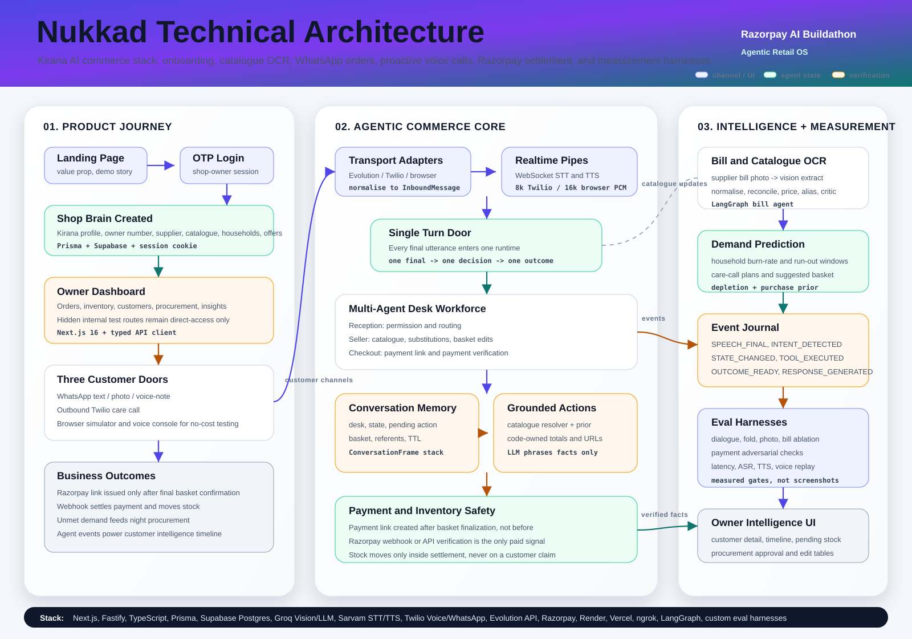

# Nukkad

A kirana shop's own ordering agent.

Household staples are the most predictable demand in Indian retail: a family
gets through its atta, oil, salt and chai at a near-fixed rate, and runs out on
a rhythm you can forecast. Nukkad forecasts it, **calls the household before
they run out**, takes the order in spoken Hinglish, and sends the bill and a
Razorpay payment link on WhatsApp.

No new app for the customer. No new device for the shop. The phone and the
customer are already there.

---

## Technical architecture



Nukkad is built as an agentic retail operating system, not a single chatbot.
The landing page and OTP login create the shop context; the dashboard then
gives the owner catalogue upload, inventory, customers, procurement and order
control. Every customer channel normalises into the same backend turn shape,
so WhatsApp text, WhatsApp photos, voice notes, Twilio care calls and browser
test consoles all reach the same conversation brain.

The core runtime is split into desks: Reception asks permission and routes,
Seller owns catalogue resolution and basket edits, Checkout owns payment-link
creation and payment verification, and Enquiry answers read-only status
questions. Each turn writes an event trail, so the dashboard can show what the
agent heard, which desk owned the decision, which tool ran, and which verified
business outcome was produced.

Payment is deliberately separate from speech. A customer can ask to order, add
or remove items, hear the basket, and only then confirm that the payment link
should be sent. Razorpay links and WhatsApp receipts are generated by code,
not typed by the model; payment becomes real only through the Razorpay webhook
or a direct Razorpay verification call.

The measurement layer mirrors the product: dialogue gates, resolver folds,
photo-list checks, bill-agent ablations, payment adversarial tests, ASR/TTS
benchmarks, voice replay and latency ledgers. These are the proof points for
the architecture, because each harness exercises the production modules rather
than a simplified demo copy.

---

## Why this is an AI product, not a form with a chatbot on it

The hard part is not transcription. It is that people do not order in SKUs:

> *"bhaiya wo peela wala tel aur do kilo ashirwaad ata bhej dena, aur haan chai patti bhi"*

One misspelled brand, one item named only by its colour, one with no name at
all. Getting from that to three priced line items is the product.

Nukkad does it by refusing to treat it as a transcription problem. Instead of
asking "what words were said", it asks "which of the four hundred things *this
shop* stocks did *this household* most likely mean". Accuracy is measured by an
ablation harness in `apps/eval`, which scores each layer independently:

| Layer | What it adds |
| --- | --- |
| `raw` | audio → text → item, nothing else |
| `plus-catalogue` | rank against this shop's actual catalogue |
| `plus-prior` | weight by what this household buys every month |
| `plus-confirmation` | hold anything under the confidence floor for confirmation |

The middle two are the whole trick. Words alone send *"sunflower oil"* to the
wrong brand; the household's last order lands it on the right one.

---

## Layout

```
apps/
  api/       Fastify 5 · the agent, resolver, payments, WhatsApp
  web/       Next.js 16 · landing page, shop dashboard, simulator
  eval/      the ablation harness that produces the accuracy numbers
packages/
  db/        Prisma 6 schema and client
  shared/    types, zod validators, money helpers, consumption constants
```

### The bill agent

Photographing a supplier bill is the onboarding hero path, and it runs as a
LangGraph state machine rather than a script:

```
extract -> retrieve -> reconcile -> price -> alias -> critic -> persist
```

Two rules hold it together. The model **never free-recalls**: every judgement
is made over candidates retrieved from real rows, so it picks from a list or
declines. And **arithmetic is not the model job** -- scores, price deltas and
margins are computed in code, and the model is asked only what is genuinely
linguistic.

Matching is trigram similarity in Postgres over product names *and* their
aliases, banded by score. Near-exact matches skip the LLM entirely; only the
uncertain middle costs a model call; a critic node then tries to *refute* each
match before it is trusted. Anything still unclear is left for the owner
rather than guessed, because a wrong merge corrupts a stock count and a price
at once.

### Measuring the bill agent

The resolver has always had an ablation ladder; the bill agent had nothing,
so every claim about what its nodes were worth was a story. `apps/eval/src/bill.ts`
runs each fixture through the graph once per rung and scores against ground
truth the fixture generator writes alongside the images:

```bash
npm run eval:bill
npm run eval:bill -- bill-devanagari.png
```

On a Devanagari bill whose Rate column is blank -- eleven lines, five read:

| rung | found | qty | rate | amount | **complete** |
| --- | --- | --- | --- | --- | --- |
| extract-only | 0% | 0% | 0% | 0% | **0%** |
| plus-normalise | 45% | 45% | 0% | 45% | **0%** |
| plus-repair | 45% | 45% | 45% | 45% | **45%** |
| plus-verify | 45% | 45% | 45% | 45% | **45%** |
| plus-critic | 45% | 45% | 45% | 45% | **45%** |

*complete* counts a line only when it was found AND quantity, rate and amount
are all exact. Partial credit would hide the failure that matters: a
confident wrong number written into a shop's prices.

Two design points the numbers depend on. The photograph is read ONCE and
that reading is reused by every rung -- re-reading per rung measures how much
the vision model varies between calls, not the node under test, and the first
version of this harness showed `critic` taking a fixture from 40% to 100%,
which is impossible. And `normalise` is ordered before `repair`, because
while the names are still in Devanagari nothing matches, every metric reads
zero, and repair's contribution hides underneath a matching failure.

The 45% ceiling is extraction: only five of eleven lines were read off this
fixture. Nothing downstream can recover a line that was never seen.

### The product knowledge base

`packages/shared/src/constants/product-kb.ts` is the retrieval corpus: 426
products and 1,664 local names -- North and South Indian, plus a brand
lexicon, because at a counter people ask for "colgate" and "nirma" far
more often than for toothpaste or detergent. Seeded with

```bash
npm run db:seed:kb
```

It exists so alias generation retrieves instead of inventing. A bill prints
the trade name; a customer says something else that is never on the bill.
Asked cold, a model produces confident nonsense; given the real names of the
nearest known products it mostly copies. Subnames are how a spoken order
finds a SKU, so this is the highest-leverage data in the system.

### apps/api

| Path | Responsibility |
| --- | --- |
| `services/asr` | speech → text for Hinglish voice notes |
| `services/extraction` | utterance → loose item mentions |
| `services/resolver` | mentions → ranked catalogue SKUs (the core) |
| `services/substitution` | what to offer when the asked-for brand is out |
| `services/depletion` | per-household burn rate and run-out forecasting |
| `services/conversation` | the channel-agnostic brain |
| `services/bills` | supplier bill → catalogue, via a vision model |
| `services/payments` | Razorpay payment links and webhook verification |
| `channels/` | one adapter per transport (Twilio WhatsApp, in-app simulator) |

The conversation core is deliberately channel-agnostic: `channels/` adapters
normalise an inbound message into one shape, so the same brain serves WhatsApp,
the voice call, and the simulator without branching.

---

## Running it

Requires Node 20+.

```bash
npm install
cp .env.example .env      # then fill it in
npm run db:generate
npm run db:push
npm run db:seed
npm run dev
```

Web on `:3001`, API on `:3000`.

Useful targets:

```bash
npm run dev:web           # landing + dashboard only
npm run dev:api           # API only
npm run eval              # run the ablation harness
npm run type-check        # every workspace
npm run smoke --workspace=@nukkad/api
```

### Configuration

Every secret is read from a single root `.env`; `.env.example` lists the full
set. Nothing is committed — `.env` is gitignored, and the workspace scripts
load it through `dotenv-cli` so Prisma and `tsx` see the same values.

Two database URLs on purpose: `DATABASE_URL` points at the Supabase session
pooler, which is reachable over IPv4, while the direct host is IPv6-only.

---

## Status

Built for the Razorpay AI Buildathon 2026. See `PRD.md` for the full product
requirements, the platform constraints that shaped the design, and the build
plan.
