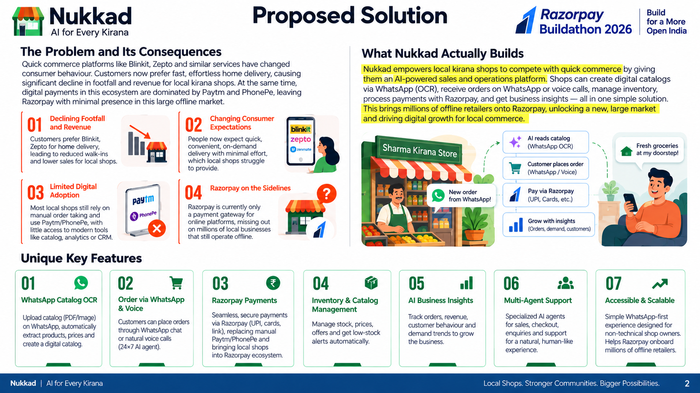
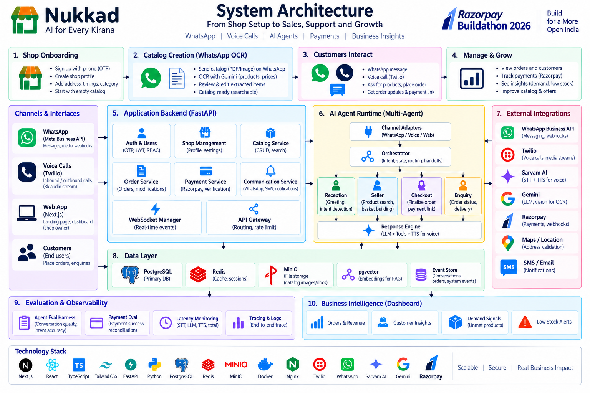

# Nukkad

A kirana shop's own AI commerce agent.

Nukkad helps local kirana stores compete with Blinkit and Zepto without asking
customers to install a new app. The shop owner keeps using the dashboard and
WhatsApp. The customer keeps using WhatsApp and phone calls. Behind that simple
surface, Nukkad predicts household run-out, captures orders in Hinglish, edits a
grounded basket, sends a Razorpay payment link, verifies payment, and turns
unmet demand into supplier restocking intelligence.



## Why It Matters

Quick-commerce apps changed customer behavior: people now expect essentials to
arrive at home with almost no effort. Local shops still know their customers
better than anyone, but their operations are trapped in manual WhatsApp notes,
memory-based stock, phone calls, cash, Paytm and PhonePe.

That also means Razorpay often stays only at the edge of commerce: a checkout
button on large platforms, while neighborhood retail keeps payments outside the
Razorpay network. Nukkad moves Razorpay into the operating layer of local
commerce: order creation, payment links, verified settlement, reconciliation,
and recovery when a customer claims they have paid.

## What Nukkad Builds

Nukkad is not a chatbot bolted onto a form. It is an agentic retail operating
system for a small shop.

- Shop onboarding starts with OTP login, shop profile, address, timings,
  category, catalog, suppliers and customer households.
- Supplier bills and handwritten catalog photos are read by vision OCR, repaired
  into structured rows, matched to real SKUs, reviewed by the owner and saved.
- Customers order over WhatsApp using text, images, voice notes or payment
  messages.
- A realtime care-call agent calls households before likely run-out, speaks in
  Hinglish, listens through Sarvam STT, edits a basket, and sends the final bill
  only after confirmation.
- Razorpay payment links are generated by code, not hallucinated by the model.
- Razorpay webhooks and direct verification are the only way money becomes paid.
- The dashboard shows orders, stock, customers, procurement approvals, call
  traces, payment state, demand signals and business intelligence.
- Eval harnesses measure dialogue quality, resolver accuracy, bill OCR,
  payment safety, ASR/TTS behavior and latency on the production modules.

## Technical Approach



## Product Flow

1. The shop owner lands on the web app and logs in with phone OTP.
2. Nukkad creates the shop brain: kirana profile, owner session, catalog,
   households, supplier records, offers and payment settings.
3. The owner uploads supplier bills or sends catalog images on WhatsApp.
4. The bill agent extracts products, quantities, prices and GST rows, normalises
   names, resolves aliases, asks a critic to reject bad matches, and persists
   only reviewed catalog rows.
5. Customers interact through WhatsApp, web simulator, voice notes or real
   Twilio calls.
6. Every channel becomes the same normalized turn: customer, shop, message type,
   transcript/media, channel id and idempotency key.
7. The multi-agent runtime routes the turn to Reception, Seller, Checkout or
   Enquiry.
8. The current desk reads the conversation memory stack: basket, pending action,
   referents, last options, customer prior, stock and payment state.
9. Tools perform the business action: resolve product, add/remove basket line,
   create link, verify payment, answer status or record unmet demand.
10. The response is generated from the verified outcome and sent back through
    the same channel.

## WhatsApp Commerce

Nukkad supports two WhatsApp paths behind the same adapter contract.

- Twilio WhatsApp is the production-safe path for official messaging.
- Evolution API is the development path for hackathon volume and local testing.

Inbound messages are normalized before they touch the agent. Text becomes a
plain turn. Voice notes go through ASR. Images go through OCR. Payment replies
are routed to the payment correctness and verification layer instead of being
trusted as proof.

For catalog OCR, the flow is:

```text
WhatsApp image/PDF
  -> media fetch
  -> vision OCR
  -> unit and price repair
  -> ProductKb retrieval
  -> fuzzy SKU match
  -> LLM critic
  -> owner review
  -> catalog commit
```

For customer ordering, the flow is:

```text
message/voice/photo
  -> item extraction
  -> catalogue resolver
  -> household prior and stock scoring
  -> basket edit
  -> confirmation
  -> Razorpay payment link
  -> WhatsApp bill receipt
```

## Voice Agent

The browser voice page and the Twilio call path share the same conversation
spine. The browser streams PCM over WebSocket. Twilio streams 8k mu-law frames
over Media Streams; the API decodes and resamples them before Sarvam receives
audio.

```text
Twilio call connects
  -> Media Stream WebSocket
  -> 8k mu-law decode
  -> 16k PCM bridge
  -> Sarvam realtime STT
  -> final utterance gate
  -> conversation runtime
  -> Sarvam streaming TTS
  -> Twilio audio playback
```

The important rule is one final utterance becomes one decision and one verified
outcome. Partials can update the UI, but only finals execute tools. Barge-in
stops playback, but it does not create a second semantic turn.

## Agent Runtime

Nukkad uses desk ownership instead of one general model prompt.

| Desk | Responsibility |
| --- | --- |
| Reception | Greeting, consent, call purpose and routing |
| Seller | Product search, substitutions, basket edits and recommendations |
| Checkout | Final basket, payment link creation and payment status |
| Enquiry | Read-only answers about orders, delivery and store information |

The runtime keeps a conversation memory stack rather than scattered globals.

```text
ConversationFrame
  desk
  state
  basket
  pending action
  pending product
  referents
  last bot question
  expiry / TTL
```

This is what makes phrases like "haan", "nahi", "bhej do", "yeh wala" and
"aata mat daalna" resolve against the current situation instead of becoming
generic model guesses.

## Payment Safety

The model can discuss payment, but it cannot mark payment successful.

```text
customer says "payment ho gaya"
  -> classify as PAYMENT_CLAIM
  -> verify Razorpay order/link/payment state
  -> if paid: settle order and stock
  -> if not paid: ask customer to complete the same link
```

Payment links are created only after final basket confirmation. Settlement is
driven by Razorpay webhook signature verification or a direct Razorpay API
check. This protects the system from prompt injection and from ordinary customer
mistakes.

## Evaluation And Measurement

The eval layer tests production modules, not toy copies.

| Harness | What it proves |
| --- | --- |
| Dialogue suite | Multi-turn desk routing, basket edits, checkout and refusal handling |
| Resolver fold | Hinglish product names map to the right catalog SKUs |
| Photo list eval | Shopping-list images become structured basket lines |
| Bill OCR ablation | OCR, repair, match, verify and critic contribution by rung |
| Payment adversarial eval | "I paid" is verified, never trusted |
| ASR bench | Sarvam, Shunya and Whisper behavior on real Hinglish audio |
| TTS and latency scripts | First sound, full turn time, speaker switch and barge-in behavior |

The dashboard also writes an event journal for demos: heard text, desk, intent,
tool call, verified outcome, latency and response.

## Monorepo Layout

```text
apps/
  api/       Fastify, agent runtime, WhatsApp, voice, OCR, payments
  web/       Next.js dashboard, landing page, customer intelligence, simulators
  eval/      ablation and adversarial harnesses

packages/
  db/        Prisma schema, seed data, Supabase client
  shared/    validators, product KB, money helpers, common types

docs/        architecture notes, deployment runbooks, generated README images
media/       demo images, bill fixtures, voice clips and presentation assets
```

## Core Stack

- Frontend: Next.js, React, TypeScript, Tailwind CSS
- Backend: Fastify, Node.js, TypeScript, Prisma
- Database: Supabase Postgres, pgvector, Prisma Client
- AI: Groq OSS LLMs, Qwen vision models, Sarvam STT/TTS
- Voice: WebSockets, Twilio Voice Media Streams, PCM bridge, Sarvam realtime
- WhatsApp: Twilio WhatsApp sandbox for official path, Evolution API for dev
- Payments: Razorpay payment links, HMAC webhook verification, reconciliation
- Measurement: custom eval harnesses, latency ledgers, event journal
- Deployment: Vercel for web, Render for API, Render/local for Evolution

## Running Locally

Requires Node 20 and npm 11.

```bash
npm install
cp .env.example .env
npm run db:generate
npm run db:push
npm run db:seed
npm run dev
```

Local URLs:

- Web: `http://localhost:3001`
- API: `http://localhost:3000`
- Evolution manager, when running locally: `http://localhost:8080/manager`

Useful scripts:

```bash
npm run dev:web
npm run dev:api
npm run build
npm run type-check
npm run eval
npm run eval:bill
npm run eval:adversarial
npm run dialogue --workspace=@nukkad/api
npm run fold --workspace=@nukkad/api
npm run latency --workspace=@nukkad/api
```

## Environment

The API validates environment variables at boot and exits loudly if a required
value is missing.

Required production groups:

- Database: `DATABASE_URL`, optional `DIRECT_URL`
- Session: `SESSION_SECRET`
- Groq: `GROQ_API_KEY`, model overrides if needed
- Sarvam: `SARVAM_API_KEY` for voice STT/TTS
- Twilio: `TWILIO_ACCOUNT_SID`, `TWILIO_AUTH_TOKEN`, `TWILIO_WHATSAPP_FROM`,
  `TWILIO_VOICE_FROM` or `TWILIO_SMS_NUMBER`
- Razorpay: `RAZORPAY_KEY_ID`, `RAZORPAY_KEY_SECRET`,
  `RAZORPAY_WEBHOOK_SECRET`
- Web: `NEXT_PUBLIC_API_URL`
- Public webhooks: `PUBLIC_BASE_URL`
- Development WhatsApp: `EVOLUTION_URL`, `EVOLUTION_APIKEY`,
  `EVOLUTION_INSTANCE`, `EVOLUTION_SHOP_PHONE`

## Deployment

Recommended hackathon deployment:

| Surface | Host | Notes |
| --- | --- | --- |
| Web | Vercel | Set `NEXT_PUBLIC_API_URL=https://nukkad-api.onrender.com` |
| API | Render Web Service | Build with `npm install --include=dev && npm run render:api:build`; start with `npm run start --workspace=@nukkad/api` |
| Database | Supabase Postgres | Runtime URL uses the pooler; migrations use direct URL |
| WhatsApp dev gateway | Evolution API | Use spare WhatsApp number only; production path is official Twilio/Meta |
| Payments | Razorpay | Webhook URL: `${PUBLIC_BASE_URL}/rzp/webhook` |
| Voice calls | Twilio | Media Stream routes to the API public base URL |

## Demo Loop

1. Owner logs in and sees the shop dashboard.
2. Owner uploads or sends a supplier bill; Nukkad turns it into catalog rows.
3. Customer chats on WhatsApp or receives a care call before household staples
   run out.
4. Agent builds and edits the basket with grounded catalog resolution.
5. Customer confirms checkout.
6. Nukkad sends a Razorpay payment link on WhatsApp.
7. Customer payment is verified through Razorpay, not trusted from speech.
8. Dashboard shows the conversation timeline, payment state, stock movement,
   unmet demand and supplier restock action.

## Status

Built for Razorpay AI Buildathon 2026.

Current focus: make the full local-retail loop reliable enough for live judging:
WhatsApp OCR, grounded ordering, realtime care calls, Razorpay payment
verification, owner approval, supplier restocking and measurement harnesses.
